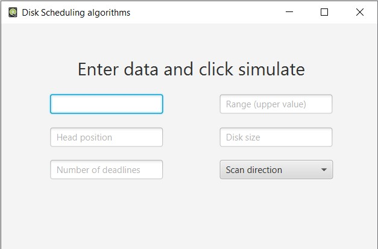
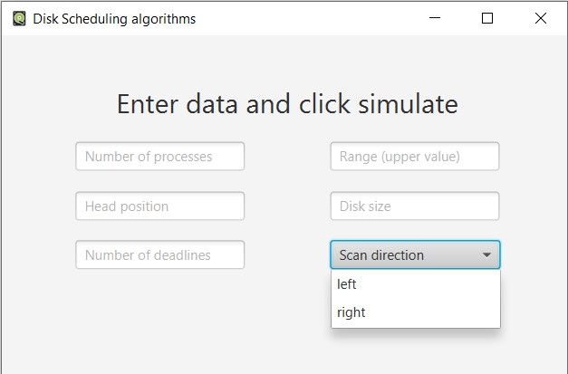
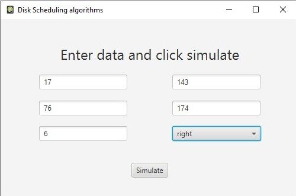
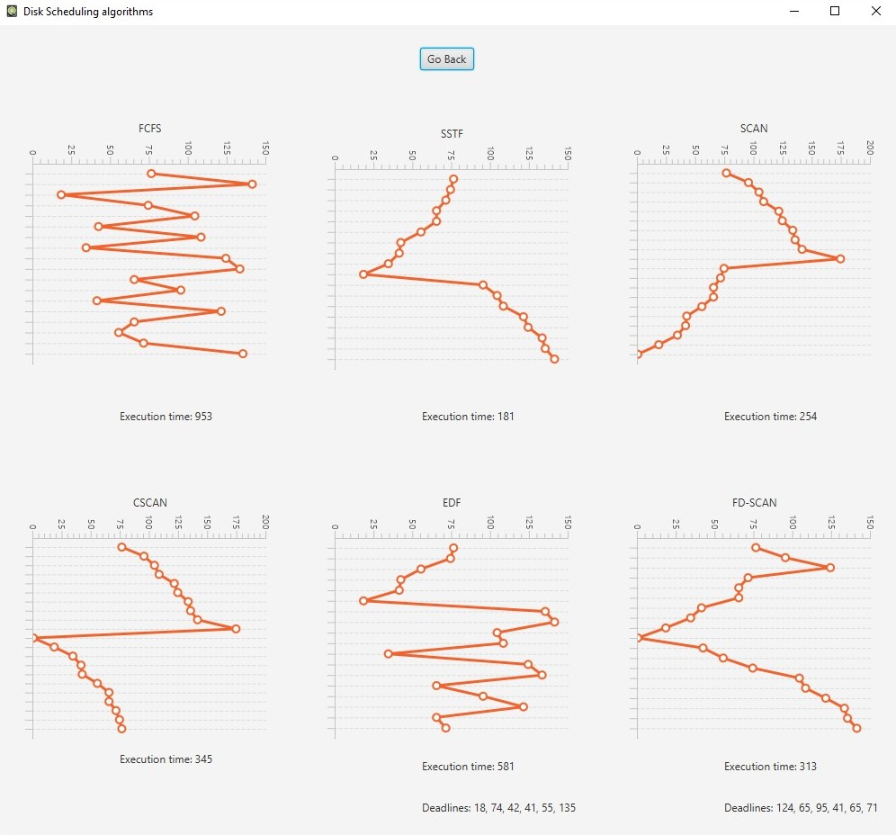

Introduction
============

Disk Scheduling done by operating systems to schedule I/O requestsarriving for the disk. Disk scheduling is also known as I/O scheduling.
One may notice that disk scheduling is important when multiple I/O
request may arrive by different processes and only one I/O request can
be served at a time. It is worth noticing that two or more request may
be far from each other so it can result in greater disk arm movement.
Hard drives are one of the slowest parts of the computer system and thus
need to be accessed in an efficient manner.

Types of CPU scheduling Algorithm
============

**1. First Come First Serve**\
First Come First Serve is the simplest of all the Disk Scheduling
Algorithms. In FCFS, the requests are addressed in the order they arrive
in the disk queue. Every request gets a fair chance but it may not
provide the best possible service.\
**2. Shortest Seek Time First (SSTF)**\
Requests having shortest seek time are executed first. The seek time of
every request is calculated in advance in the queue and then they are
scheduled according to their calculated seek time. SSTF is certainly an
improvement over FCFS as it decreases the average response time and
increases the throughput of system.\
**3. SCAN :**
In SCAN algorithm the disk arm moves into a particular direction and
services the requests coming in its path and after reaching the end of
disk, it reverses its direction and again services the request arriving
in its path.\
**4. C-SCAN**\
In CSCAN algorithm the disk arm instead of reversing its direction goes
to the other end of the disk and starts servicing the requests from
there. So, the disk arm moves in a circular fashion and this algorithm
is also similar to SCAN algorithm CPU cycle.\
**5. Earliest Deadline First (EDF)**\
EDF uses a queue to order requests according to the time each request
must be completed (its deadline).\
**6. FD-SCAN**\
FD-SCAN is a hybrid algorithm that combines EDF with SCAN scheduling.
SCAN-EDF starts with EDF ordering but services requests with the same
deadline using SCAN order.

User interface
==============

Home page
---------

All input fields
----------------

Entering Data
-------------

Simulation
----------

Features
========

Simulation of the following algorithms
--------------------------------------

* FCFS
* SSTF)
* SCAN
* CSCAN
* EDF (for requests without deadlines FCFS scheduling is used)
* FD-SCAN

Adjustable input parameters
---------------------------

* number of operations
* max range of seek
* head position
* disk size
* number of operations with deadlines
* direction of scanning

Dashboard style visualisation
-----------------------------

* Paths that visualise algorithms
* Execution time
* Processes with deadlines

Usage
=====

1. Enter custom data:
    * Number of operations
    * Range of seek (from 0 to given number)
    * Head position (smaller than max seek)
    * Disk size (larger than max seek)
    * Number of processes with deadlines (smaller than number of processes)
    * Disk size (larger than max seek)
1. After entering data, “simulate” button will appear
1. Click “simulate” button

Requirements to run this project
================================

* Java FX
* Java 8+

Conclusion
==========

After performing all calculations one can notice that each algorithm is
unique in its own way. Overall Performance depends on the number and
type of requests. There are advantages as well as disadvantages of every
algorithm. On the one hand FCFS gives every request a fair chance and
there are no indefinite postponement. On the other hand this algorithm
does not try to optimize seek time and may nor provide the best possible
service. When it comes to SSTF algorithm, one may notice that average
response time decreases but we hat to calculate seek time in advance and
SSTF can cause starvation for a request if it has higher seek time as
comparing to incoming request. After calculations we may notice that
SCAN has low variance of response time and low average response time but
it provides long waiting time for request for locations just visited by
disk arm. When it comes to CSCAN algorithm it cannot be denied that it
provides more uniform wait time compared to SCAN. EDF and FD-SCAN are
dedicated to serve real time requests.
